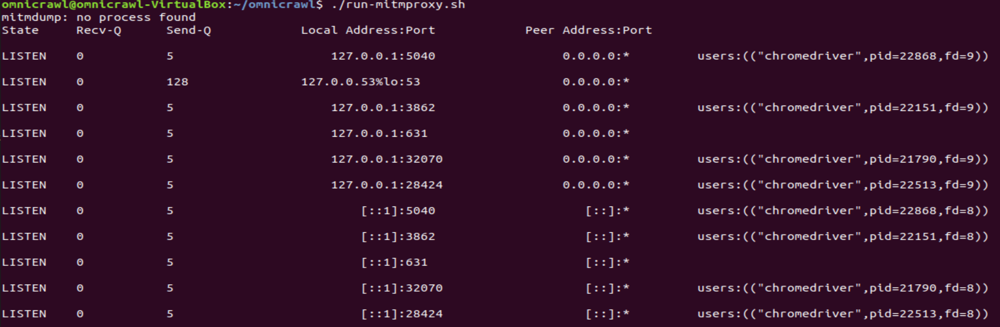
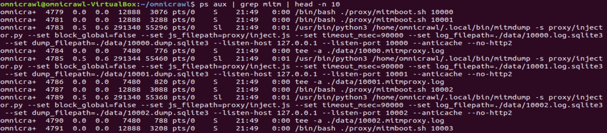
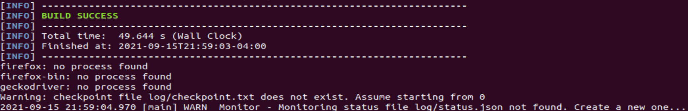

# Virtual Machine Artifact

## Overview
To facilitate reproduction of this infrastructure for testing purposes, we have provided a VirtualBox virtual machine with OmniCrawl pre-loaded and ready to run over a set of websites.

The virtual machine can be found [here](https://cmu.box.com/s/q6dv2frer4kmdtc4wzwmmx1fzdzr94j2) in Open Virtualization Format (OVF). Please note that it is fairly large at around 11 GB.

### A note on validity
This virtual machine runs just a subset of the desktop browsers from our crawl. It does not replicate the entirety of the setup (described in the [readme](../README.md)), which requires 22 physical machines, including 18 Android phones. Additionally, to simplify setup, the crawler, proxy, and desktop browsers are all run on a single Linux host (the VM). In our crawl, we run all of these components on different machines, and the desktop browsers in particular are run on Windows to ensure ecological validity. Thus, this VM serves to simply showcase the underlying crawling infrastructure.
## Setup
Requirements: [VirtualBox](https://www.virtualbox.org) or equivalent virtualization software that supports OVF files must be used. VirtualBox itself supports the x86_64 architecture so machines of other architectures (e.g., `arm64` as found on Apple Silicon Macs) will not be compatible.

Under the _default configuration_ the host machine running the VM must have at least a dual-core CPU, 8 GB of RAM, and around 15 GB of disk space (ideally using an SSD). The configuration used for testing this VM was a Core i7-9750H processor with 32GB of RAM and a SSD with sufficient disk space and ~2GB/s read and write speeds.

Setup steps:
1. Download the virtual machine image.
2. Import the image into into VirtualBox. (Please see this [documentation](https://docs.oracle.com/cd/E26217_01/E26796/html/qs-import-vm.html) for instructions).
3. Start the VM (named OmniCrawl). It should login automatically, but if it does not both the username and the password are `omnicrawl`.
4. Configure the crawler according to your available time and resources (see below) if desired. If not, the pre-loaded default configuration can be used without modifications.

### Modifications for more or less time and resources

The **default configuration** runs the proxy, Chrome, and Firefox. It crawls the Tranco Top 100 sites using this version of the [Tranco list](https://tranco-list.eu/list/4ZWX).
Under this configuration the host machine running the VM must have at least a dual-core CPU, 8 GB of RAM, and around 15 GB of disk space (ideally using an SSD). The crawl itself will take around **4 hours**.
- To change the amount of **time** the crawl takes, adjust the number of sites being crawled by setting `NUM_SITES` in this file `src/main/java/MultithreadCrawler.java` on this line: `final List<String> allUrls = Resource.loadTrancoList(NUM_SITES);`. The default is `NUM_SITES=100`.
  - If a different set of sites is desired for use that can be done by changing, in `src/main/java/Resource.md`, the line `public final static String TRANCO_LIST` to point to a different list. Note that `NUM_SITES` will need to be updated to be not larger than the length of the list.
- To reduce the amount of **resources** the crawl uses there are two things that can be done reduce the set of browsers to just Chrome or just Firefox by commenting out one of those two from the list of desktop browsers in this file: `src/main/java/MultithreadCrawler.java`, this list: `List<List<DesktopBrowser>> desktopBrowsers = Arrays.asList(...);`.

## Running the test crawl

After the virtual machine has been imported and the crawl is configured, running the crawl uses a similar set of instructions as found in our main [readme](../README.md):
1. Run the Ubuntu terminal application by either selecting it from the dock on the left, or by right-clicking on the desktop and selecting "Open Terminal".
2. Navigate to the repository folder which is at `/home/omnicrawl/omnicrawl`. This can be done with `cd ~/omnicrawl`.
3. Run the proxy with `./run-mitmproxy.sh`. You should see output that looks like this: 
4. Verify that the proxy instances have launched: `ps aux | grep mitm | head -n 10`. You should see output like this: 
5. Run the crawler with `python3 start.py`. This will compile the infrastructure and run the crawler. At the end of the compilation, you should see this output: 

## Expected behavior

Once the crawler is run, Chrome and Firefox should appear and disappear onscreen, each time loading a different site from the list of sites to crawl.

Crawl data and log files for each browser are stored in the proxy's configured data directory (`./data` by default) and are prefixed with the listening port assigned to the browser (`10000` for Chrome and `10003` for Firefox, by default).

- `PORT.log.sqlite3`: logging of requests and API accesses.
- `PORT.mitmproxy.log`: mitmdump raw logs
- `PORT.dump.sqlite3`: saved resources (js, html)

At the end of the crawl, the main crawl data will be in the data directory in `10000.log.sqlite3` and `10003.log.sqlite3`. These sqlite3 databases can then be loaded and inspected using any software compatible with sqlite3 (for our analysis we use the Python3 `sqlite3` module). There will also be files for other ports (e.g., `39001.log.sqlite3`) but they will not contain any data.
